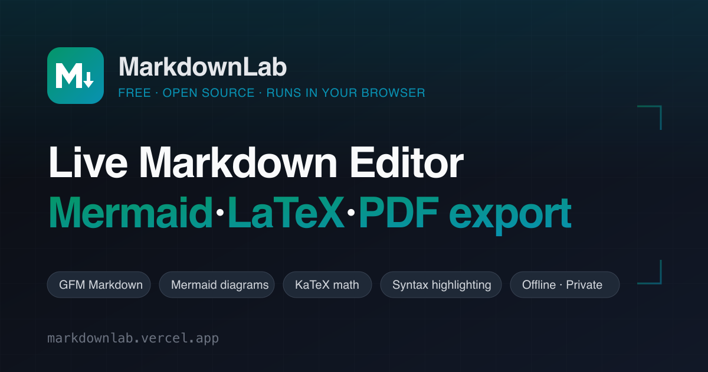
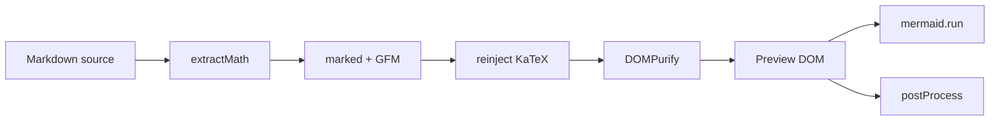
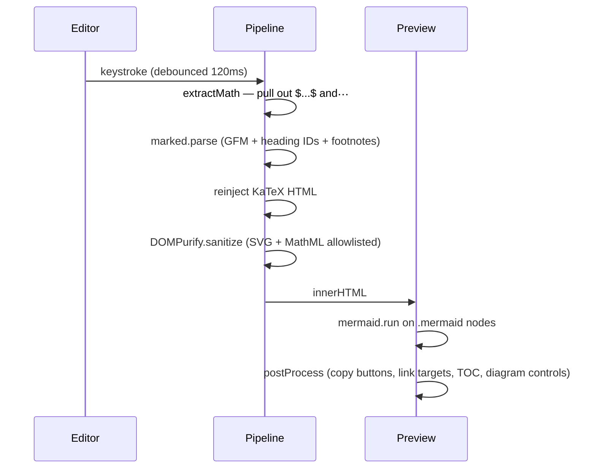

<div align="center">

<a href="https://markdownlab.vercel.app/">
  
</a>

# MarkdownLab

**A full-feature Markdown editor that runs entirely in your browser.**
Live preview · Mermaid diagrams · LaTeX math · syntax highlighting · works offline.

<p>
  <a href="https://markdownlab.vercel.app/">
    
  </a>
</p>

<p>
  <a href="LICENSE"></a>
  <a href="#how-it-works"></a>
  <a href="#privacy-and-security"></a>
</p>

</div>

---

MarkdownLab is a client-side Markdown workspace. Paste any content, watch it render live, export to HTML or PDF. The app is a static single page — your documents never touch a server, and after the first load it works without a connection.

## Highlights

- **Live split preview** with content-aware scroll sync (block-by-block, not ratio)
- **Full GFM** — tables, task lists, footnotes, heading anchors, `[!NOTE]` / `[!WARNING]` alerts
- **Mermaid diagrams** — flowchart, sequence, class, state, ER, Gantt, pie, mindmap, gitGraph, journey
- **KaTeX math** — inline `$x$` and display `$$…$$` with MathML output for screen readers
- **Syntax highlighting** across 190+ languages via highlight.js
- **Multi-file projects** with sidebar, draggable tabs, fuzzy search, and `⌘P` command palette
- **Export** to self-contained HTML, vector PDF (native print), or Markdown source
- **Zero backend** — IndexedDB on your device, DOMPurify on untrusted HTML, no analytics or cookies

## Quick start

Use the hosted version at **[markdownlab.vercel.app](https://markdownlab.vercel.app/)**, or run locally:

```sh
git clone https://github.com/invincible04/markdownlab.git
cd markdownlab
open index.html            # or: python3 -m http.server 8000
```

No build step, no package manager. `index.html` is the entry point and pulls pinned runtime dependencies from jsdelivr on demand.

## What it renders

GitHub's README renderer supports Mermaid and LaTeX natively — so the examples below are the same output MarkdownLab produces in the editor.

**A Mermaid flowchart:**



**LaTeX math:**

$$\nabla \cdot \vec{E} = \frac{\rho}{\varepsilon_0} \qquad \nabla \times \vec{B} - \frac{1}{c^2}\frac{\partial \vec{E}}{\partial t} = \mu_0 \vec{J}$$

**Syntax-highlighted code:**

```typescript
async function render(src: string): Promise<string> {
  const { body, math } = extractMath(src);
  const html = marked.parse(body);
  return DOMPurify.sanitize(reinjectMath(html, math));
}
```

**GitHub-style alerts:**

> [!NOTE]
> MarkdownLab uses the same alert syntax GitHub does — `> [!NOTE]`, `[!TIP]`, `[!IMPORTANT]`, `[!WARNING]`, `[!CAUTION]`.

## Features

| Area | What you get |
|---|---|
| **Content** | GFM, footnotes, alerts, Mermaid (10 diagram types), KaTeX (inline + block), 190+ highlighted languages |
| **Editing** | Live split preview with end-to-end latency under 40 ms, content-aware scroll sync, soft-wrapped editor with accurate line numbers, focus mode, reading mode |
| **Projects** | Sidebar with projects + files, draggable tabs, fuzzy search, command palette (`⌘P`), find-and-replace with regex, folder import, undoable delete |
| **Diagrams** | Click-to-zoom lightbox, cursor-focal wheel zoom, 2× PNG export with inlined computed styles, redraws on theme change, WCAG AA palette |
| **Exports** | Self-contained HTML, vector PDF (native `window.print()`), Markdown source, clipboard copy of rendered HTML or source |
| **UX** | Dark + light themes (WCAG AA in both), keyboard-first navigation, responsive drawer on mobile |
| **Offline** | Service worker caches the app shell and pinned CDN deps on first visit; installable as a PWA |
| **Privacy** | 100% client-side; documents in IndexedDB (origin-isolated), DOMPurify sanitization, strict Mermaid security level, no analytics, no cookies |
| **A11y** | Semantic HTML, ARIA roles on dialogs, visible focus rings, MathML alongside visual math, respects `prefers-reduced-motion` |

<details>
<summary><b>Full capability list</b> (click to expand)</summary>

### Editing
- Debounced 120 ms render loop, typical end-to-end latency under 40 ms
- Soft-wrapped editor with a hidden mirror that keeps line math correct
- Line numbers track soft-wrapped lines exactly
- Per-file autosave — cursor position, scroll, and dirty indicator
- `Tab` inserts two spaces; `Ctrl+F` / `Ctrl+H` open find / find-and-replace with regex

### Projects and files
- IndexedDB storage (localStorage fallback for private browsing)
- Drag-reorder files within or across projects
- Middle-click or `⌘W` to close tabs; `⌘Tab` to cycle
- Fuzzy search across every project and file from the sidebar or palette
- `⌘P` + `⌘Enter` creates a new file from the current query
- 7-second undo toast on deletes — no accidental permanent loss

### Diagrams
- Interactive lightbox with drag-to-pan and scroll-to-zoom
- Wheel zoom calibrated for both mouse wheels and trackpad pinch
- 2× PNG export with inlined computed styles — colors match on-screen output exactly
- Auto theme — diagrams redraw on theme toggle without re-parsing the document

### Exports
- HTML export inlines KaTeX + highlight.js CSS when the network is reachable; falls back to CDN `<link>` tags otherwise
- PDF export uses `window.print()` inside a hidden light-themed iframe — true vector output with selectable text and working hyperlinks
- Markdown export, rendered-HTML copy, and source copy from the same menu

### UX
- Three view modes (editor / split / preview), resizable divider
- Focus mode hides all chrome; floating glass dock keeps theme, outline, reading, and exit accessible
- Reading mode — opt-in serif typography with a narrower column
- Sidebar collapses to a swipe-dismissible drawer on small screens

</details>

## Use cases

<table>
<tr>
<td width="33%" valign="top">

### Engineering

Architecture RFCs with inline Mermaid, incident post-mortems with Gantt timelines, runbook fragments with GFM alerts and highlighted code, preview of raw GitHub issue/PR bodies before posting.

</td>
<td width="33%" valign="top">

### Research & writing

Academic notes with inline and block equations that render identically on any device. Prototype data-science notebooks' narrative sections. Long-form drafts in reading mode with serif typography.

</td>
<td width="33%" valign="top">

### Ops & docs

Runbook fragments with syntax-highlighted code and GitHub-style callouts. Chart documentation previews. Self-contained HTML exports for reports. 2× PNG diagram exports for slide decks.

</td>
</tr>
</table>

## Keyboard shortcuts

| Shortcut | Action |
|---|---|
| <kbd>Ctrl/Cmd</kbd> + <kbd>1</kbd> / <kbd>2</kbd> / <kbd>3</kbd> | Editor / Split / Preview view |
| <kbd>Ctrl/Cmd</kbd> + <kbd>P</kbd> | Command palette / quick open |
| <kbd>Ctrl/Cmd</kbd> + <kbd>F</kbd> | Find in file |
| <kbd>Ctrl/Cmd</kbd> + <kbd>H</kbd> or <kbd>Ctrl/Cmd</kbd> + <kbd>Shift</kbd> + <kbd>F</kbd> | Find and replace |
| <kbd>Ctrl/Cmd</kbd> + <kbd>B</kbd> | Toggle sidebar |
| <kbd>Ctrl/Cmd</kbd> + <kbd>N</kbd> | New file in active project |
| <kbd>Ctrl/Cmd</kbd> + <kbd>W</kbd> | Close current tab |
| <kbd>Ctrl/Cmd</kbd> + <kbd>Tab</kbd> | Next tab (add <kbd>Shift</kbd> for previous) |
| <kbd>Ctrl/Cmd</kbd> + <kbd>K</kbd> | Toggle theme |
| <kbd>Ctrl/Cmd</kbd> + <kbd>.</kbd> | Toggle focus mode |
| <kbd>Ctrl/Cmd</kbd> + <kbd>L</kbd> | Toggle outline |
| <kbd>Ctrl/Cmd</kbd> + <kbd>O</kbd> | Open file(s) |
| <kbd>Ctrl/Cmd</kbd> + <kbd>S</kbd> | Download Markdown |
| <kbd>F2</kbd> | Rename file (in sidebar) |
| <kbd>/</kbd> | Focus sidebar search |
| <kbd>?</kbd> or <kbd>Ctrl/Cmd</kbd> + <kbd>/</kbd> | Show all shortcuts |
| <kbd>Esc</kbd> | Exit focus / close dialog |
| <kbd>+</kbd> / <kbd>−</kbd> / <kbd>0</kbd> | Zoom in / out / fit (diagram viewer) |
| <kbd>Tab</kbd> | Insert two spaces (editor) |

## How it works



1. **extractMath** pulls `$…$` and `$$…$$` out of the source (skipping fenced and inline code) and renders each with KaTeX, leaving placeholders.
2. **marked** parses the placeholder-substituted source. A custom renderer emits Mermaid fences as `<div class="mermaid">` so they survive sanitization.
3. **reinjectMath** swaps the placeholders back with the pre-rendered KaTeX HTML.
4. **DOMPurify** sanitizes with SVG and MathML allowlisted.
5. **mermaid.run** replaces each `.mermaid` div with an SVG.
6. **postProcess** attaches copy buttons to code blocks, opens external links in new tabs, wires smooth scroll on anchor links, and attaches the zoom control to each diagram.

## Privacy and security

The app is a static single page — no backend, no analytics, no cookies, no tracking pixels. Documents are stored in the browser's IndexedDB (origin-isolated, never uploaded). You can inspect or delete them via DevTools → Application → IndexedDB → `mdlab`.

Every piece of rendered HTML passes through **DOMPurify** with a conservative allowlist. Mermaid runs with `securityLevel: 'strict'` (inline event handlers and external references blocked). A strict Content Security Policy in [`vercel.json`](vercel.json) whitelists only the pinned CDN origins and the site's own assets.

After the first load, a service worker serves the app shell and pinned CDN dependencies from cache, so the editor works without a connection. Offline-only edits still persist to IndexedDB.

## Self-hosting

Drop the repo onto any static host (GitHub Pages, Netlify, Cloudflare Pages, S3, Vercel, plain nginx). The app is 100% static — no build step, no env vars, no secrets.

If you're publishing a fork under your own domain, update these in one pass:

- **Canonical URL** — find-and-replace `markdownlab.vercel.app` across `index.html`, `robots.txt`, `sitemap.xml`, `llms.txt`, and `design/og-image.svg`
- **Repo link** — find-and-replace `github.com/invincible04/markdownlab` in `index.html` (`sameAs`, footer, About modal) and `llms.txt`
- **OG image** — regenerate `og-image.png` from the edited `design/og-image.svg`. The steps are in [`design/README.md`](design/README.md)
- **Host headers** — `vercel.json` is Vercel-specific. For Netlify or Cloudflare Pages, translate the `headers[]` list into `_headers`. For nginx or Apache, copy the directives into your server block.
- **CSP hash** — if you edit the inline async-CSS script in `<head>`, recompute its SHA-256 and update `script-src` in `vercel.json`:

  ```sh
  python3 -c "import hashlib,base64; s=open('script-body.txt').read(); print('sha256-'+base64.b64encode(hashlib.sha256(s.encode()).digest()).decode())"
  ```

## FAQ

<details>
<summary><b>Is MarkdownLab really free?</b></summary>

Yes — free and open source under the MIT license. Every feature is available without payment, sign-up, or email capture.
</details>

<details>
<summary><b>Does it work offline?</b></summary>

Yes. After the first page load, the app runs entirely in your browser. Documents persist in IndexedDB and survive reloads and browser restarts. CDN assets are cached by the service worker on first visit.
</details>

<details>
<summary><b>Which markdown flavor is supported?</b></summary>

GitHub Flavored Markdown (GFM) via the [`marked`](https://marked.js.org/) parser, plus heading-ID and footnote extensions.
</details>

<details>
<summary><b>Can I render Mermaid diagrams?</b></summary>

Yes — any fenced block tagged <code>mermaid</code> renders as an interactive diagram with click-to-zoom and 2× PNG export. All 10 diagram types Mermaid 10.9 supports.
</details>

<details>
<summary><b>How do I export to PDF?</b></summary>

Export → Download PDF uses the browser's native print engine for crisp vector output with real pagination and working hyperlinks. No rasterization library needed.
</details>

<details>
<summary><b>Is my markdown private?</b></summary>

Completely. No backend, no analytics, no cookies. Documents never leave your device; you can inspect or delete them via DevTools → Application → IndexedDB → <code>mdlab</code>. The source is on GitHub — audit it yourself.
</details>

<details>
<summary><b>What browsers are supported?</b></summary>

Any modern browser with ES Modules support — Chrome, Firefox, Safari, Edge, Brave, Arc — on desktop and mobile. The last two stable versions of each are tested.
</details>

## Under the hood

All runtime dependencies are public, version-pinned, and loaded from jsdelivr on demand. No package manager, no lockfile, no bundler.

| Library | Version |
|---|:---:|
| [marked](https://marked.js.org/) | 12.0.2 |
| [marked-gfm-heading-id](https://github.com/markedjs/marked-gfm-heading-id) | 3.1.3 |
| [marked-footnote](https://github.com/bent10/marked-extensions) | 1.2.4 |
| [mermaid](https://mermaid.js.org/) | 10.9.1 |
| [KaTeX](https://katex.org/) | 0.16.11 |
| [highlight.js](https://highlightjs.org/) | 11.10.0 |
| [DOMPurify](https://github.com/cure53/DOMPurify) | 3.2.7 |

PDF export uses the browser's native `window.print()` API against a hidden, light-themed iframe — no rasterization library. SVG diagram export is a pure-browser `canvas.toBlob('image/png')` with inlined computed styles. Both are zero-dependency.

## Contributing

Bugs, feature ideas, and PRs are welcome — [open an issue](https://github.com/invincible04/markdownlab/issues) or submit a PR. There's no build step: clone, edit, open `index.html`, reload. The code is vanilla HTML/CSS/JS (ES modules), with comments explaining the non-obvious bits.

## License

[MIT](LICENSE) — use it, fork it, build on it, ship your own version.
